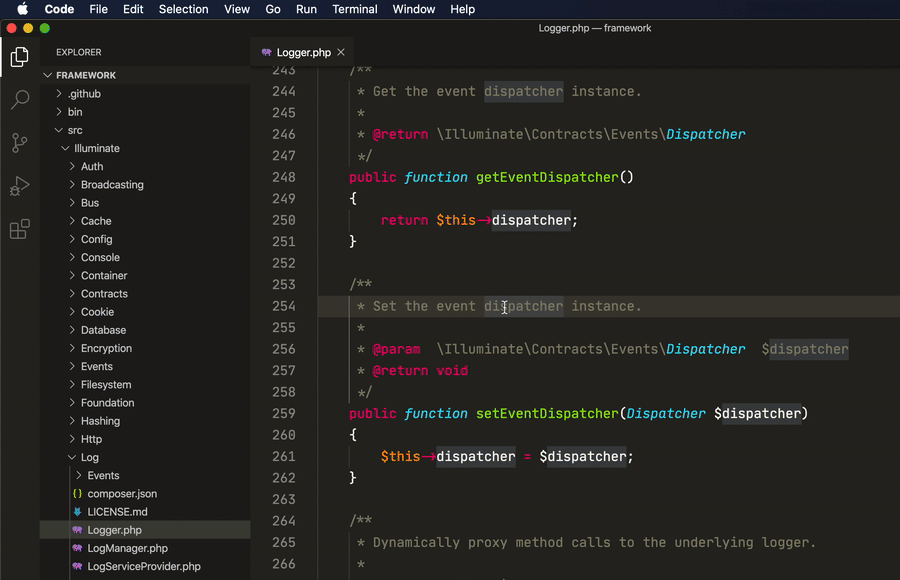

# Open git repos in browser directly from VS Code

This lightweight plugin was created as I often need to point out specific spots in repos to other people, bookmark them for future use for myself etc. Instead of opening repo in browser and browsing to necessary file/line manually GitUrl plugin allows to do it directly from Visual Studio Code automatically.

GitHub, Bitbucket and GitLab repos are supported out of the box.



## Installation

Clone or install repo into new subdirectory in Visual Studio Code extensions directory (~/.vscode/extensions)

Linux
```
git clone https://github.com/kurtmoser/vscode-giturl.git ~/.vscode/extensions/giturl
```

Mac
```
git clone https://github.com/kurtmoser/vscode-giturl.git ~/.vscode/extensions/giturl
```

Windows
```
git clone https://github.com/kurtmoser/vscode-giturl.git "C:\Users\<username>\.vscode\extensions\giturl
```

## Configuration

GitUrl supports GitHub, Bitbucket and GitLab repos out of the box. However you can additionally configure your own self-hosted git services by adding new entries to "giturl.domains" array in settings.

Entry key must be domain name where git service is hosted.

Supported properties for "giturl.domains" entry:
- "url": Default branch url pattern (required)
- "urlCommit": Commit url pattern
- "urlBranch": Branch url pattern
- "line": Fragment for marking specific line in url
- "lineRange": Fragment for marking line range in url

Supported keys for url pattern:
{domain}, {user}, {repo}, {path},  {revision}, {line}, {lineEnd}

Example configurations:
```
"giturl.domains": {
    "mydomain.com": {
        "url": "https://{domain}/{user}/{repo}/blob/{revision}/{path}",
        "line": "#L{line}"
    }
}
```
```
"giturl.domains": {
    "mydomain.net": {
        "url": "http://{domain}/projects/{user}/repos/{repo}/browse/{path}",
        "urlCommit": "http://{domain}/projects/{user}/repos/{repo}/browse/{path}?at={revision}",
        "urlBranch": "http://{domain}/projects/{user}/repos/{repo}/browse/{path}?at=refs/heads/{revision}",
        "line": "#{line}",
        "lineRange": "#{line}-{lineEnd}"
    }
}
```
